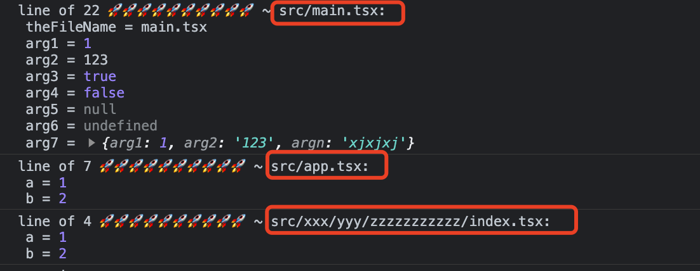
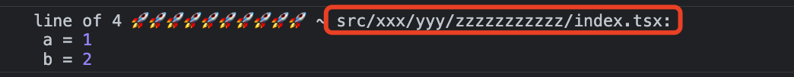
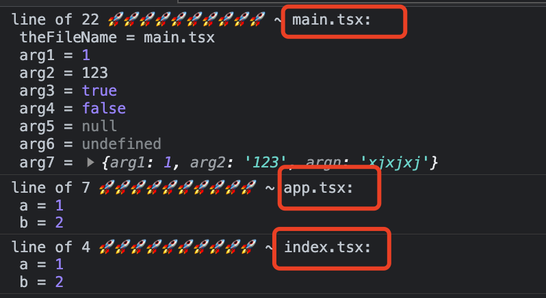

<p align="center">
<h1 align="center">babel-plugin-enhance-log</h1>
</p>

<div align="center">
  一个用来为console.log添加代码行数，log所在文件名，log参数名以及添加分隔符的插件

[![NPM version][npm-image]][npm-url] ![NPM downloads][download-image]

![Test][test-badge] ![codecov][codecov-badge]


[npm-image]: https://img.shields.io/npm/v/babel-plugin-enhance-log.svg?style=flat-square
[npm-url]: http://npmjs.org/package/babel-plugin-enhance-log


[download-image]: https://img.shields.io/npm/dm/babel-plugin-enhance-log.svg?style=flat-square


[test-badge]: https://github.com/baozouai/babel-plugin-enhance-log/actions/workflows/ci.yml/badge.svg

[codecov-badge]: https://codecov.io/github/baozouai/plugin-babel-plugin-enhance-log/branch/master/graph/badge.svg


</div>

中文 | [英文](./README.md)

## 📦  安装

```sh
pnpm add babel-plugin-enhance-log -D
# or
yarn add babel-plugin-enhance-log -D
# or
npm i babel-plugin-enhance-log -D
```
## ⚙️ 参数

```ts
interface Options {
  /**
   * 打印的前缀提示，这样方便快速找到log 🚀🚀🚀🚀🚀🚀🚀🚀🚀🚀
   * @example
   * console.log('line of 1 🚀🚀🚀🚀🚀🚀🚀🚀🚀🚀', ...)
   */
  preTip?: string
  /** 每个参数分隔符，默认空字符串，你也可以使用换行符\n，分号；逗号，甚至猪猪🐖都行~ */
  splitBy?: boolean
  /** 
   * 是否需要endLine
   * @example
   * console.log('line of 1 🚀🚀🚀🚀🚀🚀🚀🚀🚀🚀', ..., 'line of 10 🚀🚀🚀🚀🚀🚀🚀🚀🚀🚀')
   *  */
  endLine?: boolean
  /**
   * 打印文件名
   * 如果你文件名太长，希望不显示文件path的目录，比如src/pages/xxx/yyy/a.tsx, 那么可以配置enableDir为false，则只打印a.tsx
   * 
   * @default true
   */
  enableFileName?: boolean | {
    enableDir?: boolean
  }
  /** 可以指定项目根目录地址，默认是process.cwd()，会用于处理文件名生成 */
  root?: boolean
}
```

 ## 🔨 使用

```js
// babel.config.js
/** @type {import('babel-plugin-enhance-log').Options} */
const enhanceOption =  {  
      preTip: '🚀🚀🚀🚀🚀🚀🚀🚀🚀🚀', // default 
      splitBy: '', // default
      endLine: false // default
}
module.exports = {

  plugins: [
    ['enhance-log', 
    enhanceOption
   ]
  ],
}
```


## 👇 例子

比如说，你不喜欢小 🚀，你喜欢猪猪 🐖，那可以配置 preTip 为 🐖🐖🐖🐖🐖🐖🐖🐖🐖🐖：


比如说，在参数较多的情况下，你希望 log 每个参数都换行，那可以配置 splitBy 为 `\n`：


或者分隔符是`;`:


当然，你也可以随意指定，比如用个狗头🐶来分隔：


又比如说，有个 log 跨了多行，你希望 log 开始和结束的行数，中间是 log 实体，那可以将 endLine 设置为 true：


> 我们可以看到开始的行数是13，结束的行数是44，跟源码一致 

又比如说，你希望知道log所在的文件名，那么可以配置enableFileName为true（当然默认就是true）：



如果文件路径太长:



你只希望打印文件名，不需要目录前缀，那么可以配置 `enableFileName: { enableDir: false }`:


## 📄 协议

babel-plugin-enhance-log 遵循 [MIT 协议](./LICENSE).