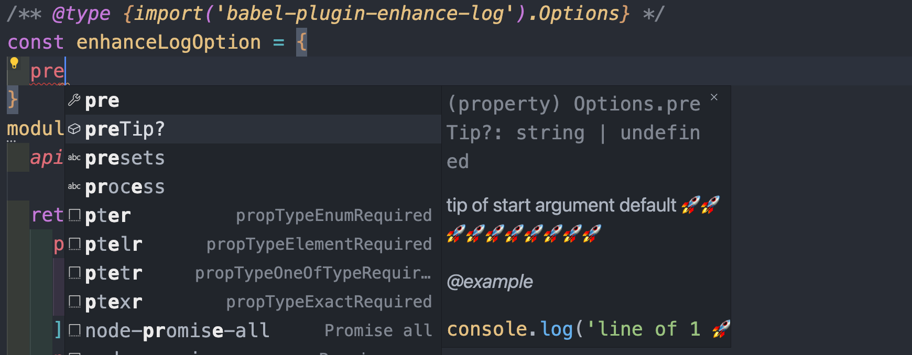
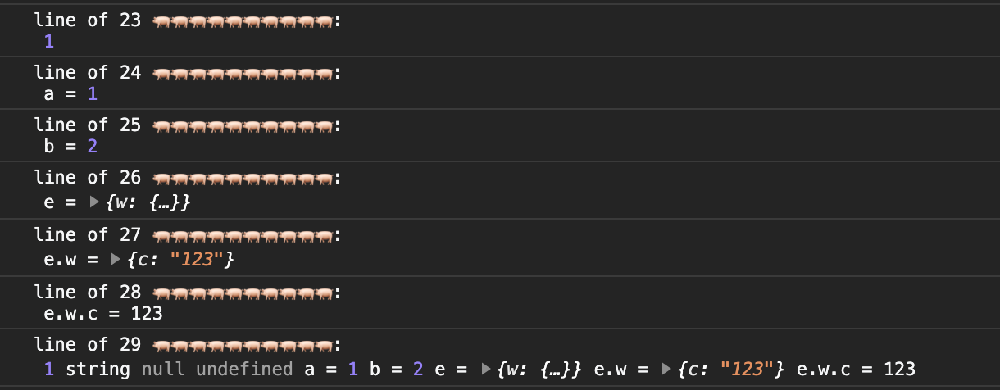
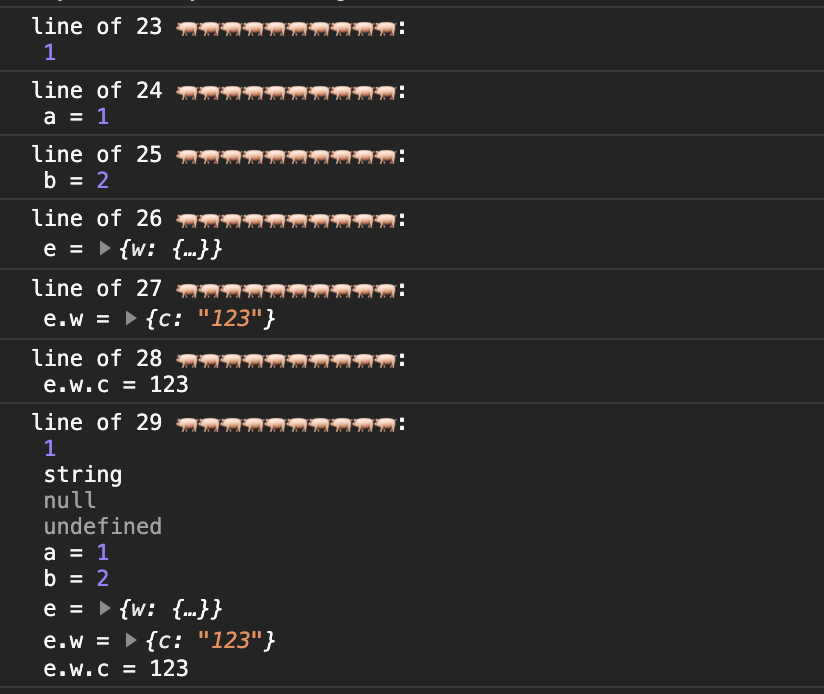
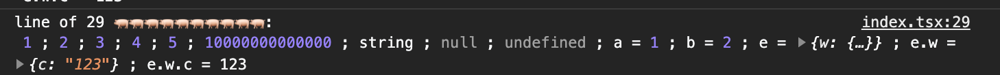
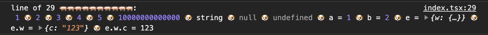
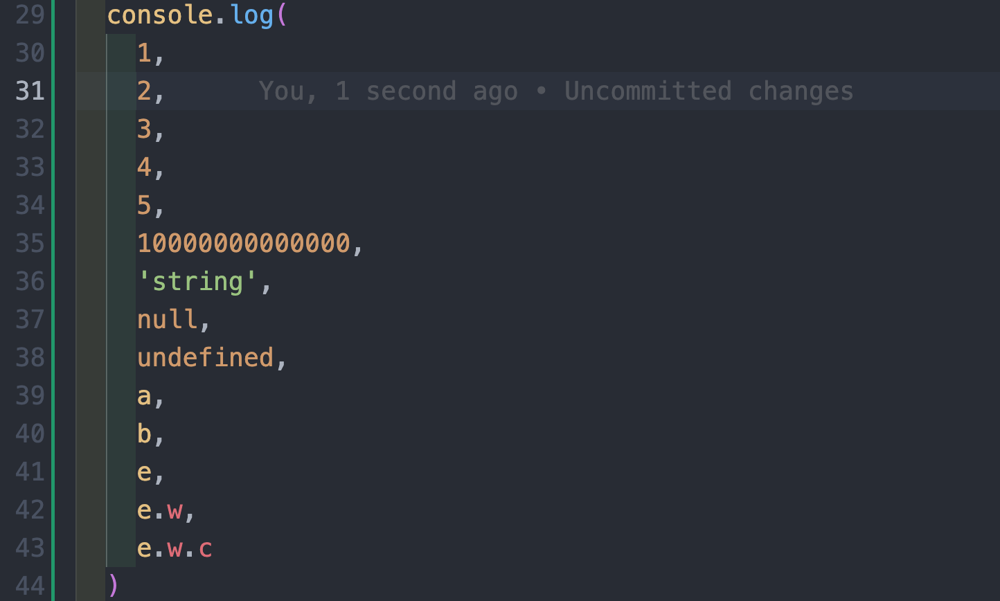
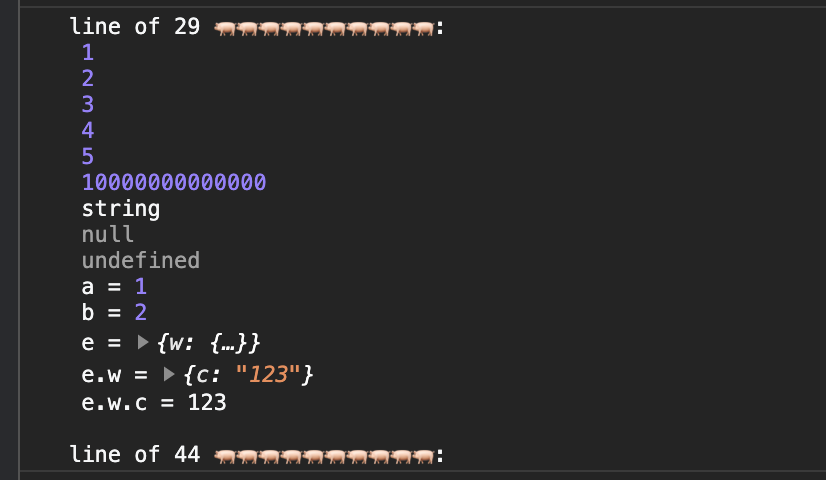

<p align="center">
<h1 align="center">babel-plugin-enhance-log</h1>
</p>

<div align="center">
  A babel Plugin to add log line, add log argument name and separator

 [![NPM version][npm-image]][npm-url] ![NPM downloads][download-image]

![Test][test-badge] ![codecov][codecov-badge]


[npm-image]: https://img.shields.io/npm/v/babel-plugin-enhance-log.svg?style=flat-square
[npm-url]: http://npmjs.org/package/babel-plugin-enhance-log


[download-image]: https://img.shields.io/npm/dm/babel-plugin-enhance-log.svg?style=flat-square


[test-badge]: https://github.com/baozouai/babel-plugin-enhance-log/actions/workflows/ci.yml/badge.svg

[codecov-badge]: https://codecov.io/github/baozouai/plugin-babel-plugin-enhance-log/branch/master/graph/badge.svg


</div>

English | [中文](./README-zh_CN.md)

## 📦  Install

```sh
pnpm add babel-plugin-enhance-log -D
# or
yarn add babel-plugin-enhance-log -D
# or
npm i babel-plugin-enhance-log -D
```


## ⚙️ Options

```ts
interface Options {
  /**
   * tip of start argument default 🚀🚀🚀🚀🚀🚀🚀🚀🚀🚀
   * @example
   * console.log('line of 1 🚀🚀🚀🚀🚀🚀🚀🚀🚀🚀', ...)
   */
  preTip?: string
  /** the delimiter for each parameter is an empty string by default, you can also use a newline \n, a semicolon';' a comma',' or even a pig '🐖' */
  splitBy?: boolean
  /** 
   * need endLine, default false
   * @example
   * console.log('line of 1 🚀🚀🚀🚀🚀🚀🚀🚀🚀🚀', ..., 'line of 10 🚀🚀🚀🚀🚀🚀🚀🚀🚀🚀')
   *  */
  endLine?: boolean
}
```
##  🔨 Usage

```js
// babel.config.js

module.exports = {

  plugins: [
    ['enhance-log', 
    /** @type {import('babel-plugin-enhance-log').Options} */
    {  
      preTip: '🚀🚀🚀🚀🚀🚀🚀🚀🚀🚀', // default 
      splitBy: '', // default
      endLine: false
    }]
  ],
}
```


## Example

For example, if you don't like small 🚀, but you like piggy 🐖, you can configure preTip as 🐖🐖🐖🐖🐖🐖🐖🐖🐖🐖:



For example, in the case of many parameters, you want log to wrap each parameter, then you can configure splitBy as `\n`:



Or the delimiter is `;`:



Of course, you can also specify it at will, such as using a dog head 🐶 to separate:



For another example, if there is a log that spans multiple lines, you want the number of lines at the beginning and end of the log, with the log entity in the middle, then you can set endLine to true:





> We can see that the number of lines at the beginning is 13, and the number of lines at the end is 44, which is consistent with the source code

## 📄 License

babel-plugin-enhance-log is [MIT licensed](./LICENSE).